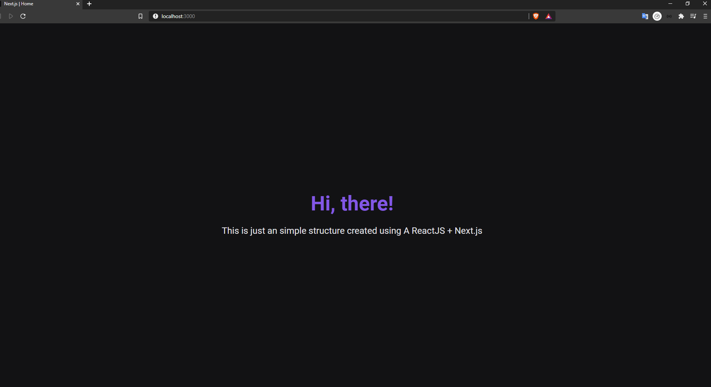

<h1 align="center">
    
</h1>


<h4 align="center">
  ReactJS + Next.js
</h4>

<p align="center">
  <a href="#-project">Project</a>&nbsp;&nbsp;&nbsp;|&nbsp;&nbsp;&nbsp;
  <a href="#rocket-techs">Techs</a>&nbsp;&nbsp;&nbsp;|&nbsp;&nbsp;&nbsp;
  <a href="#rocket-Running">Running</a>&nbsp;&nbsp;&nbsp;|&nbsp;&nbsp;&nbsp;
</p>
<br>

## 💻 Project

This is just an simple structure created using A ReactJS + Next.js.


## :rocket: Techs

- [Typescript](https://www.typescriptlang.org/)
- [ReactJS](https://reactjs.org/)
- [Next.js](https://nextjs.org/)
- [Styled Components](https://styled-components.com/)


## :notebook: Running

### Requeriments

```bash
# Clone this
$ git clone https://github.com/glauberbrack/nextjs-structure

# Go to your project folder
$ cd nextjs-structure

# Install all depencies
$ yarn

# Build your project
$ yarn build

# Run your project
$ yarn start
```
---

☕ Glauber Brack - <a href="mailto:glauber@brack.com.br?Subject=Hello%20you">Don't be shy, talk to me! (: </a>
